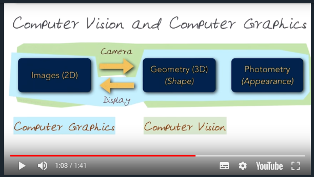

# 01 Introduction

## 1. Introduction
## 2. What is computational photography?
  * Photography: a science, art and practice of creating images by recording light or other electromagnetic radiation(from Wikipedia)
  * Computational Photography: Photography + Computing
    * "Computationalizes" the whole entrie workflow of how light is captured to generate an image(ray to pixels)
  * Combines
    * Computing
    * Digital Sensors
    * Modern Optics
    * Actuators
    * Smart Lights
    * To escape the limitations of traditional film cameras
  * Elements
    * Illumination
    * Optics
    * Sensor
    * Processing
    * Display
    * User
## 3. Dual photography
## 4. Panorama
  * Step 1: Taking Pictures - Rotating Cameras about the center axis
  * Step 2: Detection and Matching
  * Step 3: Warping(Aligning)
  *	Step 4: Fade, Blend, or Cut
  *	Step 5: Crop
## 5. Why study computational photography?
  * Pervasiveness of cameras
    * Everyone has a camera
	* Improvements in optics
	* Better, cheaper sensors(CCD/CMOS)
  * CV & CG
    * 
	* CV: from 2D to infer more things about the 3D scene
	* CG: Real world to virtual world
  * Image Processing & Optics/Sensors
	* 
  * Relationships between computational photography and traditional photography and digital photography
	* Computational photography sits all of them, and can encompass all of them