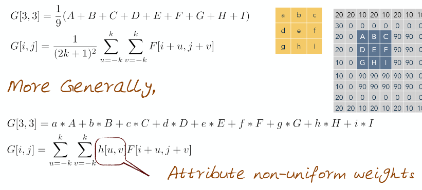

# 02 Digital Image

## 1. Digital image
  * Digital image - pixels and image resolution(width - x / height - y)
  * Discrete(matrix) and continuous(function) representations
    * x, y, I(x, y)
	* Image statistics
      * Average, median, mode...
	  * Image histogram - intensitry bins
  * Grayscale and color images
    * R, G, B channels are blended together
	* In color image, each pixel has 3 intensity
  * Digital image formats
    * Order of color channels(RGB, BGR ...)
	* Image compression information
	* Metadata about pictures(EXIF, etc...)
## 2. Point processes
  * Point-process computations -> Point arithmetic
  * Add/subtract images
  * Alpha-blending & its applications
    * Multiplying 0.34 to each image
  * Image histograms
## 3. Blending modes
  * Explain what is happening on the videos you are seeing
  * Introduce the variety of blending modes in wide use
    * Divide(brightens photos)
	* Addition(too many whites) 0-1
	* Subtract(too many blacks) 0-1
	* Difference(subtract with scaling)
	* Darken(min(a,b))
	* Lighten(max(a,b))
	* Dodge and Burn
      * Dodge(lighten) - screen mode
	  * Burn(darken) - multiply mode
## 4. Smoothing
  * Smooth an image over a neighborhood of pixels
    * How to smooth a signal
	  * 'average pixels in neighborhood'
	* Determine the 'average of neighboring values'
      * Moving average - [1 1 1 1 1] X 1/5
	  * Weighted moving average - [1 4 6 4 1] X 1/16
	  * Boundary issues
	* Mathematical representation
      * 
  * Median filtering as a special non-linear filtering and smoothing approach
    * Select median values in the kernel area
	* Reduces nosie but preserves edges(sharp lines!)
## 5. Convolution and cross-correlation
  * Cross-correlation
    * a measure of similarity of two waveforms as a function of a time-lag applied to one of them
	* sliding dot product(moving kernels)
	* replace each pixel with a linear combination of its neighbors
	* denoted by G = h ⓧ F, where h means a kernel
  * Convolution
    * Cross-correaltion results in a reversed response - 결과 G가 뒤집힌 kernel의 뒤집인 형태로 출력!
	* denoted by G = h * F
  * Difference between cross-correlation and convolution
    * 따라서 cross-correlation과 좌우/상하 대칭되게 커널을 슬라이딩: h[u, v] * F[i+u, j+v] -> h[u, v] * F[*__i-u, j-v__*]
	* X, Y 방향으로 모두 동일한 커널이 사용된다면, convolution / cross-correlation 이든 결과는 같다!
  * Properties of these methods(convlution)
    * Linear and shift invariants
	* F * G = G * F
	* (F * G) * H = F * (G * H)
## 6. Gradients
  * Detect features in an image
    * Extract higher-level features
	* 영상에서 불연결성(discontinuities)을 탐지
      * surface normal
	  * depth
	  * surface color
	  * illumination
  * Edge of an image from the perspective of information theory
	* Encode change, 따라서 edges는 효과적으로 이미지를 인코딩!
  * Use of an image gradient to compute edges
    * Edge: 이미지 intensity 함수에 급격한 변화(rapid change)가 있는 곳
	* Rapid chagne: intensity function을 미분했을 때, _극값을 보이는 곳_
	* 극값에 대한 threshold를 설정해서 그 값을 넘으면 edge로 판명 아니면 말고
  * Image gradient in continous form for a function, and in a discrete form for an image
    * Definition of image gradient
      * elements(derivatives): X, Y
	  * direction
        * positive direction(from black to white)
		* edge에 수직된 방향
	  * magnitude
	* 연속 함수에서는 일반적인 미분 형식으로 X, Y의 미분 형태를 정할 수 있다
	* 그러나 이산 함수, 특히 영상은 정수 단위이기 때문에, 차분의 정도를 1로 설정
## 7. Edges
  * Compute edges - Gradient를 계산
  * Dereivatives using kernels and neighborhood operations
    * gradient를 (F(x+1,y) - F(x,y))로 구할 수 있지만, 커널을 이용해 구할 수도 있다
	* (F(x+1,y) - F(x,y))를 [-1 1] 커널로 convolution한 걸로 표현 가능
  * 3 methods for computing edges using kernels
    * Prewitt in x: [-1 0 1; -1 0 1; -1 0 1]
	* Sobel in x: [-1 0 1; -2 0 2; -1 0 1]
	* Roberts in x: [0 1; -1 0]
  * Image noise can complicate the computation of gradients
    * 노이즈가 영상에 존재한다고 하면, gradients를 구하는데 큰 영향을 끼친다
	* 노이즈가 클 수록 gradient를 구하는데 더 큰 영향을 끼친다
	* Gradient to Edges
      * 1 Smoothing: suppress noise
	  * 2 Compute gradients -> can generate gradient magnitude image
	  * 3 Apply Edge - "enhancement" filter for contrast
	  * 4 Edge localization
	    * Determine wihch local maxima from filter ouput are actually edges vs. noise
	  * 5 Threshold, Thin
  * The canny edge detector
    * 1 Filter image with derivative of Gaussian (2 in Gradient to Edges)
	* 2 Find magnitude and orientation of gradient (2 in Gradient to Edges)
	* 3 Non-maximum suppression (3, 4 in Gradient to Edges)
      * Thin multipixel wide 'ridges' down to single pixel width
	* 4 Linking and thresholding (5 in Gradient to Edges)
      * Define low/high thresholds
      * Use the high to start edge curves and the low to continue them