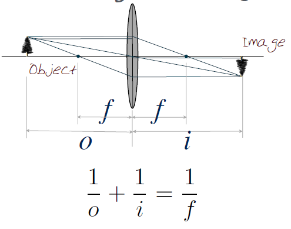
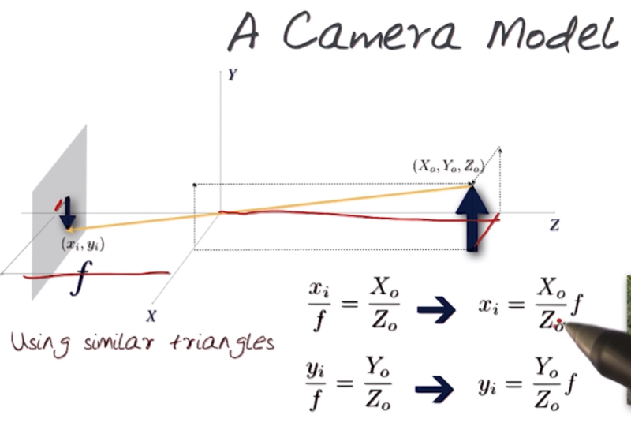
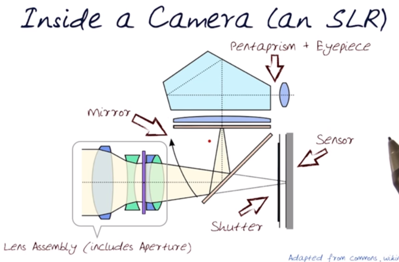

# 03 Cameras

## 1. Cameras
  * Rays to pixels  
    * [3D scene] -> Illumination -> Optics -> Sensor -> Processing -> Display -> [Image]
	* 
	* Geomtery(Perspective) / Light scattering
  * A camera without optics
    * 어떤 obstruction 없이 빛이 센서에 닿으면, 물체의 특정 부분이 센서의 특정 부분에 모이지 않아 상이 맺히지 않는다
	* 이 obstruction을 만들어 주는게, pinhole 카메라의 기본 원리!
  * Lens in the camera system
    * Pinhole size ... Light diffraction
	  * Large pinhole = geometric blur
	  * Small pinhole = diffraction blur
	  * Best pinhole = very little light
	* 핀홀을 렌즈로 대체 ... 렌즈가 ray를 모아줌
  * The lens equation
    * Geometric optics
	  * Parallel rays는 렌즈 반대편에서 렌즈로부터 f만큼 떨어진 지점에서 모두 만난다
	  * 렌즈의 중심을 지나는 rays는 굴절없이 지나간다
	* Lens equation
	  * focal length: 무한대에서 온 빛이 렌즈를 통과해 모인 지점과 렌즈 사이의 
	  * 
	  * 위의 식에서 카메라와 물체의 거리가 매우 멀면(o ≒ ∞), 초점거리와 이미지의 거리는 같아진다! (f = i)
## 2. Lenses
  * Focal length
    * Object distance가 길면 렌즈에 맺히는 상의 크기는 작아진다(Object distance ↑ => Image size ↓)
	* Focal length가 길어지면 맺히는 상의 크기 커진다(Focal length ↑ => Image size ↑)
	* Focusing: moving sensor back or forward w.r.t. to lens
  * Field of View(FOV)
    * Sensor size(h) ↓ => FOV ↓
	* Focal length(f) ↑ => FOV ↓
	* 
  * Sensor size
    * There are many kinds of sensor size: Full frame to iPhone
	* 
	* 1.26, 1.5 등의 crop factor는 [풀프레임의 대각선 길이 / 해당 센서의 대각선 길이]로 계산
    * Crop factor(위 그림의 (1:1.26)에서 1.26과 같은 표시)를 통해 렌즈의 환산 focal length를 알 수 있다!
	* 센서 타입의 1/2'' 등은 해당 센서 대각선 길이를 인치로 표현한 것 ==> 진공관 길이 1/2'' = 센서 대각선 길이 8mm
	  * 진공관 vs. 센서 - https://blog.naver.com/jazz_mir/60038917792
  * Image Formation & Capture
    * Changing focal length allows us to move back and capture the scene
	* 
	* f가 18mm 일 때 보다 180mm 일 때 카메라와 객체 간의 실제 거리는 더 길지만, 화면상으로 큰 차이가 없게 느껴진다
	* 두 객체 간의 거리는 f가 18mm 일 때 보다 180mm 일 때, 더 가깝게 느껴진다
  * Perspective Projection
    * 기본적인 카메라 모델: Perspective projection model
	* 
	* 영상이 inverted 되는 것을 고려해 영상의 투영면을 반대편에 가정
## 3. Exposure
  * Exposure
    * Irradiance x Time (H = E x T)
	* Irradiance: Amout of light falling on a unit of sensor per sec. / Controlled by lens **aperture**
	* Exposure Time: How long the **shutter** is kept open
	* 
  * Shutter Speed
    * Amount of time the sensor is exposed to light
	* Usually denoted in fractions of a second (1/2000, 1/1000, ... , 1/15, ..., 15, 30, Bulb)
  * Aperture
    * Irradiance on sensor: The amout of light captured is proportional to the area of the aperture
	* 
	* f-number가 2배 ==> aperture 직경 0.5배 ... 들어오는 빛의 양은 0.25배
	* 단, f-number ↑ ==> 사진의 depth of field(심도)는 깊어진다
  * ISO
    * Flim: 필름이 빛에 얼마나 민감하게 반응하는가(화학적 반응과 관련)
	* Digital: 센서가 빛에 얼마나 민감하게 반응하는가(센서 자체의 민감도)
	* ISO ↑ => Bright, Noise ↑
	* 
## 4. Sensor
  * Photographic processes for digital and film capture
    * Basically same
	* Difference is how light is trapped and preserved
	* Film - chemical, Digital - electronic
  * 8 layers of color film
    * 
  * 5 layers of a CCD
    * 
  * Differences between a CCD and CMOS sensor
    * Photosites in CCD are passive and do ***no work***
	* Photosites in CMOS are amplifiers and can do ***local processing*** => ***Rolling shutter*** artifact from local amplifier
	* 
  * 2 benefits of using the camera raw format
    * minimally processed, device-dependent
	* dynamic range or color