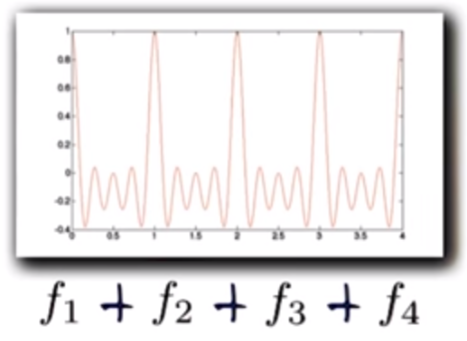
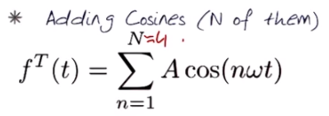
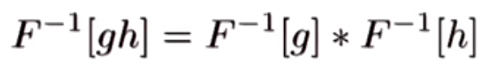
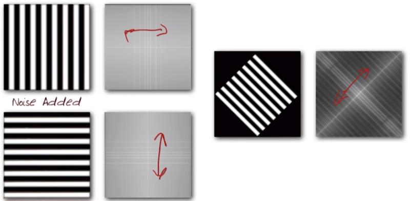
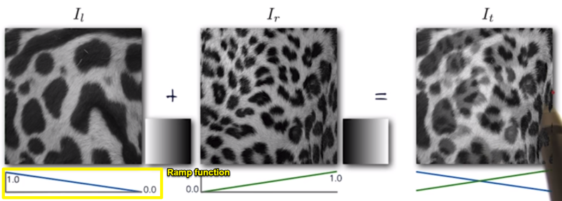
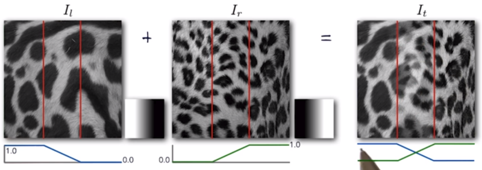
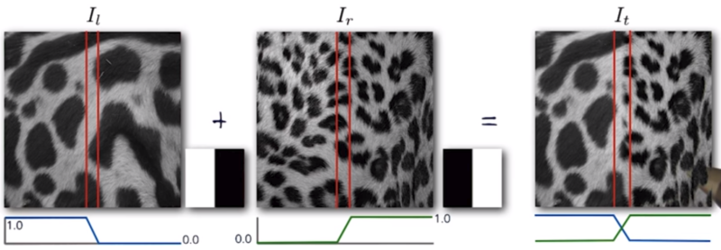
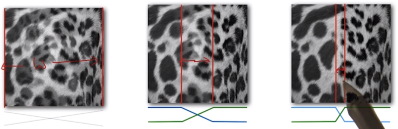
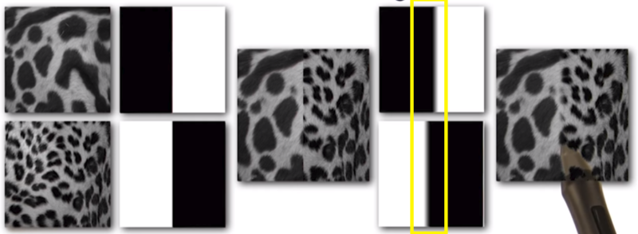

# 04 Fourier Transform

## 1. Fourier Transform
  * Using sines and cosines to reconstruct a signal
    * Target singal can be reconstructed by adding cosines
	* 
	* 
	* 		
  * The Fourier Transform
    * Periodic function: An weighted sum of sines and cosines of diffent frequencies
	* Transform f(t) ==> F(w)
	* A reversible operation
	* 	
  * Frequency Domian for a signal
    * View into frequency / time domain
	* 	
	* 		
  * 3 properties of convolution relating to Fourier Transfrom
    * Fourier transfrom of a convolution of two function = product of their Fourier transforms
	* 
	* Inverse Fourier transform of the product of two Fourier transforms = convolution of the two inverse Fourier transforms
	* 
	* Convolution in spatial domain is equivalent to multiplication in frequency domain
  * Fourier Transforms: Example
    * 
	* 
	* 
	
## 2. Blending
  * Merging two images
    * Cross-Fading
	* 
    * 
	* 
	* 
  * Window sizes used for merging images
    * To avoid seam: Window = size of <u>largest prominent</u> "feature"
	* To avoid ghosting: Window <= 2x size of <u>smallest prominent</u> "feature"
  * Advantages of a using the Fourier Domain
    * Could be hepful for the right window size ... Largest frequency <= 2x size of smallest frequency
	* Image frequency content should occupy one "octave"
	* Feather: merge the right kinds of things from two different images ... "Blur" the edges before applying the blend operations
	* 

