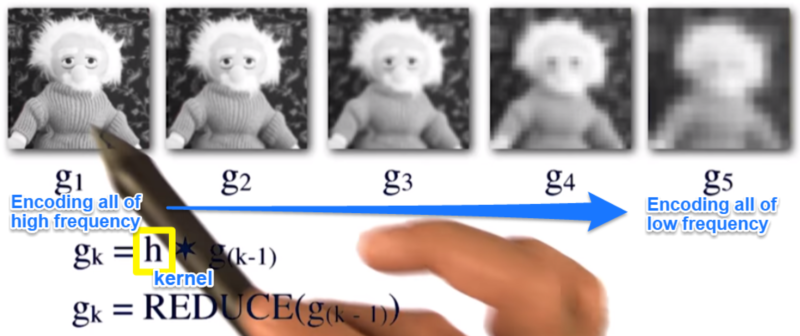

# 04-03 Pyramids

## Gaussian and the Laplacian Pyramids
  * What is a Gaussian pyramid
  * 
  * 
	
## Use of Pyramids to encode the Frequency domain
  * REDUCE
  * 
  * EXPAND
  * 

## Compute a Laplacian Pyramid from a Gaussian Pyramid
  * Laplacian function: a function between (the expanded - the original)
  * the expanded - the original = **<u>"error"</u>**
  * 

## Blend two images using Pyramids
  * Blending two images: Cross-fading two images at different frequency bands
  * 
  * Blending example
  * 
  * Masked blending - <u>Check the example code in **Image_blending_using_pyramid** folder</u>
    * (1) Build Laplacian pyramids
	* (2) Build a Gaussian pyramid from selected region R(binary filter)
	* (3) Form a combined Laplacian pyramid(blending information from one to the other) using G_R as weights
	* (4) Collapse the L_0 pyramid to get the final blended image
	* Collapse: This function accepts a laplacian pyramid, (1) then it takes the top layer, expand it, and (2) then add it to the next layer this process (3) continues until a single image remain and this will be returned as a result. - https://compvisionlab.wordpress.com/2013/05/13/image-blending-using-pyramid/
  *   
  * Masked blending example
  * 