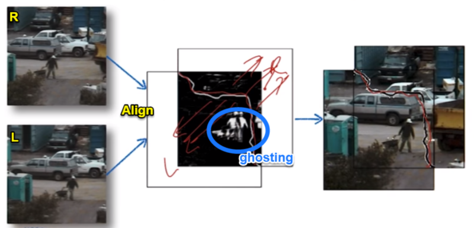

# 04-04 Cuts

## An Additional method for merging images besides blending
  * Merging images using Cut
  * 
  * Moving objects casue "ghosting"
  * 
  * Find an optimal seam as opposed to blend between images ... Let's take a loot at next chapter
  * 
	
## Finding seams in images
  * Minimizing overlap error
  * 
  * Seam finding using graph cuts
  * 

## Benefits of cutting images over blending images
  * Extending / Editing is more natural
  * 
  * 
  * Seam carving - https://en.wikipedia.org/wiki/Seam_carving
  * When <u>shrinking</u>, seam is being <u>removed</u> / When <u>stretching</u>, more seames are <u>added</u> based on the sample space
  * 