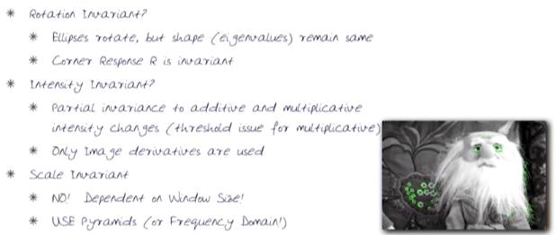

# 04-05 Features

## Benefits of Feature Detection and Matching in images
  * Types of transformation
  * 
	
## Characteristics of Good Features
  * (1) Repeatability / Precision
  * (2) Saliency / Matchability - distinctive description mathematically
  * (3) Compactness and efficiency - in terms of both computationality and the number of features
  * (4) Locality - each feature should occupy a small part of the image, not the entire image
  
## Corners are Good Features
  * Recognize a point by looking through a small window
  * Shifting a window in any direction causes a large change in intensity => **<u>Corner</u>**
  * 
  * Mathematics - Compute **<u>the change in appearance</u>** by shifting the window by u, v
  * 
  * 
  * M(second moment matrix) summarizes **<u>the predominant directions of the gradient</u>** in a specified neighborhood point ... http://darkpgmr.tistory.com/131
  * 
  * The surface E(u, v) is locally approximated by a quadratic form
  * E has the maximum value **<u>when shifting an window direction of lambda_max</u>**
  * Each eigenvalue is **<u>related to a value of E</u>**
  * 
  * But, in Harris corner corner is examined by **<u>not eigenvalues but following equation R</u>**
  * 

## Harris Corner Detector Algorithm
  * Algorithm
    * (1) Compute **<u>Gaussian derivatives(Ix, Iy)</u>** at each pixel
	* (2) Compute **<u>second moment matrix M</u>** in a Gaussian window around each pixel
	* (3) Compute **<u>corner response function R</u>**
	* (4) Threshold R
	* (5) Find local maxima of response function(non-maximum suppression)
  * Properties
    * Rotation invariant
	* Intensity invariant
	* Scale invariant??? - NO!!!
	* 

## Stages of a SIFT detector
  * Harris-Laplacian: Find local maximum of
    * Harris corner detector in space
	* Laplacian in scale
	* 
  * SIFT(Lowe, 2004): Find local maximum of
    * Difference of Gaussians(DoG) in space and space
	* DoG is simply a pyramid of the difference of Gaussians within each octave
	* 
  * SIFT main procedures
    * Orientation assignment: Compute best orientation for each keypoint region
	* Keypoint description: Use local image gradients at selected scale and rotation to describe each keypoint region
  * Image content is transformed into local feature coordinates that are invariant to translation, rotation, scale, and other image parameters

