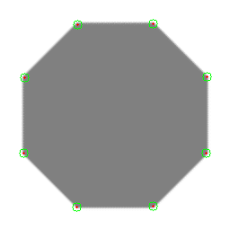

# 04-06 Feature Detection and Matching

## Harris Corner Detector Algorithm
  * Recall
    * M(second moment matrix) summarizes **<u>the predominant directions of the gradient</u>** in a specified neighborhood point ... http://darkpgmr.tistory.com/131
    * 
    * The surface E(u, v) is locally approximated by a quadratic form
    * E has the maximum value **<u>when shifting an window direction of lambda_max</u>**
    * Each eigenvalue is **<u>related to a value of E</u>**
    * 
    * But, in Harris corner corner is examined by **<u>not eigenvalues but following equation R</u>**
    * 
  * Harris Detector: Step by Step
    * (1) Compute **<u>Gaussian derivatives(Ix, Iy)</u>** at each pixel
	* (2) Compute **<u>second moment matrix M</u>** in a Gaussian window around each pixel
	* (3) Compute **<u>corner response function R</u>**
	* (4) Threshold R
	* (5) Find local maxima of response function(non-maximum suppression)
  * Harris Detector quiz - Harris_Detector_quiz.py
    * 

## SIFT
  * 