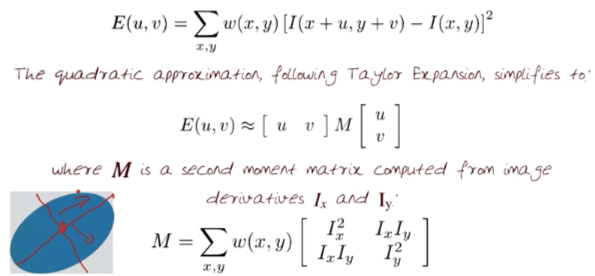
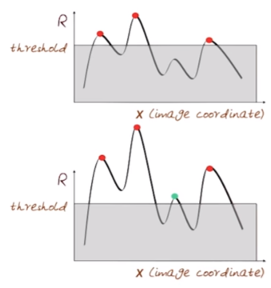
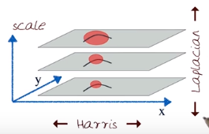

# 04-06 Feature Detection and Matching

## Harris Corner Detector Algorithm
  * Recall
    * M(second moment matrix) summarizes **<u>the predominant directions of the gradient</u>** in a specified neighborhood point ... http://darkpgmr.tistory.com/131
    * 
    * The surface E(u, v) is locally approximated by a quadratic form
    * E has the maximum value **<u>when shifting an window direction of lambda_max</u>**
    * Each eigenvalue is **<u>related to a value of E</u>**
    * 
    * But, in Harris corner corner is examined by **<u>not eigenvalues but following equation R</u>**
    * 
  * Harris Detector: Step by Step
    * (1) Compute **<u>Gaussian derivatives(Ix, Iy)</u>** at each pixel
	* (2) Compute **<u>second moment matrix M</u>** in a Gaussian window around each pixel
	* (3) Compute **<u>corner response function R</u>**
	* (4) Threshold R
	* (5) Find local maxima of response function(non-maximum suppression)
  * Harris Detector quiz - Harris_Detector_quiz.py
    * 
  * Harris Detector: Step by Step
    * (1) Compute **<u>Gaussian derivatives(Ix, Iy)</u>** at each pixel
	* (2) Compute **<u>second moment matrix M</u>** in a Gaussian window around each pixel
	* (3) Compute **<u>corner response function R</u>**
	* (4) Threshold R
	* (5) Find local maxima of response function(non-maximum suppression)
  * Properties
    * Rotation invariant
	  * Ellipse rotates but its shape(i.e. eigenvalues) remains the same
	  * Rotation is not same
	  * 
	  * Corner response **<u>R is invariant to image rotation)</u>**
	* Intensity invariant
	  * Invariance to intensity shift: I -> I + b
	  * Invariance to intensity scale: I -> a * I
	  * 
	* Scale invariant??? - NO!!!
	  * 

## SIFT
  * Scale Invariant Detection
    * Consider **<u>regions(e.g. circles) of different sizes</u>** around a point
	* Regions of corresponding sizes will look the same in both images
	* How do we choose corresponding circles independently in each image? ==> Choose the scale of the "best " corner
	* Compute **<u>the scale invariant function(f)</u>** over different size neighborhoods and Choose **<u>the scale(s1, s2 etc.) for each image</u>** where the function is a maximum
	* 
  * Key point localization in space
    * Find robust extremum(maximum or minimum) both in space and in scale
      * Space: the image itself
	  * Scale: the pyramid level
    * Use pyramid to find maximum values, then eliminate edges and pick only corners
      * Each point is compared to its **<u>8 neighbors in the current image</u>** and **<u>9 neighbors each in the scales above and below</u>**
  * Harris-Laplacian: Find local maximum of
    * Harris corner detector in space
	* Laplacian in scale
	* 
  * SIFT(Lowe, 2004): Find local maximum of
    * Difference of Gaussians(DoG) in space and space
	* DoG is simply a pyramid of the difference of Gaussians within each octave
	* 
  * SIFT main procedures
    * Orientation assignment: Compute best orientation for each keypoint region
	* Keypoint description: Use local image gradients at selected scale and rotation to describe each keypoint region
  * Image content is transformed into local feature coordinates that are invariant to translation, rotation, scale, and other image parameters