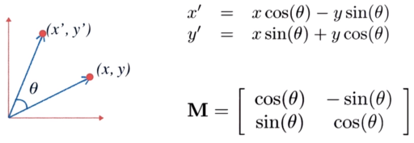
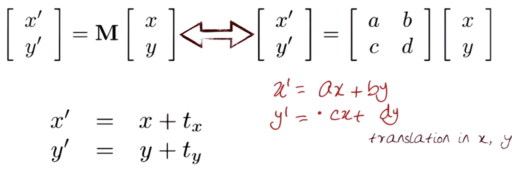
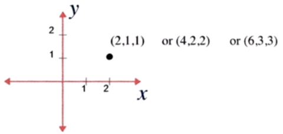
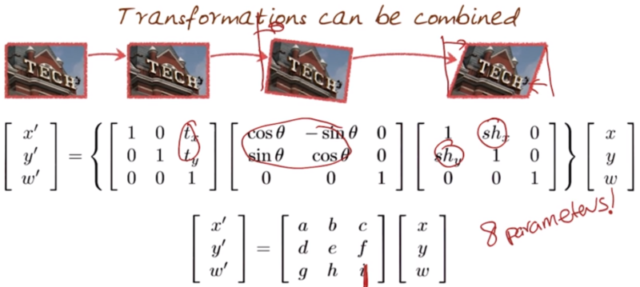
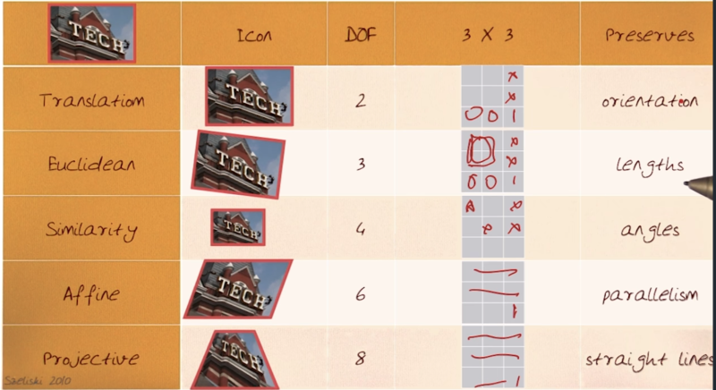

# 05-01 Image Transformation

## Transform the image
  * Image filtering: Change range of image ==> g(x) = T(f(x))
    * Intensity values ... e.g.) made image much more whiter
  * Image warping: Change domain of image ==> g(x) = f(T(x))
    * Size of the image ... # of rows, columns
  * Parametric Global Warping: Translation, Rotation, Aspect, Scale, Perspective, Affine
    * Transformation T is as a matrix transform
	* p' = T p <=> p' = M p
    * 

## Rigid Transformations: Translation, Rotations
  * 2D Rotation
  * 
  * Linear transformation are combinations of (1) Scale, (2) Roation, (3) Shear and (4) Mirror
  * Properties of linear transformations
    * Origin maps to origin
	* Lines map to lines
	* Parallel lines remain parallel
  * 2D Translation
	* 
  * Homogeneous Coordinates
    * Reperesent coordinates in 2D with a 3-vector
	* Add a 3rd coordinate to every 2D point - (x, y, w) => (x/w, y/w)
	* 
  * Basic 2D Transformation
    * 
	* The transformation matrix M can have only **<u>8 parameters</u>**
	* Homogeneous coordinates is independent to scale, **<u>the parameter i can be 1 by dividing by i</u>**

## Affine/Projective Transformation
  * Affine Transformation
    * Combines linear transformations, translations
	* Lines map to lines
	* Parallel lines remain parallel
	* Roations are preserved
	* 6 DOF
  * Projective Transformation
    * Combines Affine transformations, Projective warps
	* Lines map to lines
    * **<u>Parallel lines do not necessarily remain parallel</u>**
	* **<u>Rotaions are not preserved</u>**
	* 8 DOF
  * Recovering Transformation
	* If recovering f(x, y) -> g(x', y'), how many points do we need? ==> The problem of DoF

## Degrees of Freedom for different transformation
  * 