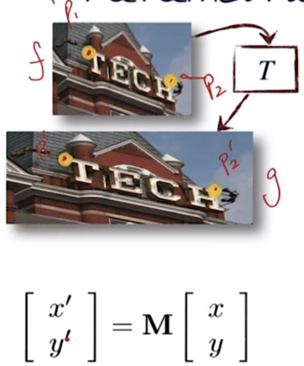

# 05-01 Image Transformation

## Transform the image
  * Image filtering: Change range of image ==> g(x) = T(f(x))
  * Image warping: Change domain of image ==> g(x) = f(T(x))
  * Parametric Global Warping: Translation, Rotation, Aspect, Scale, Perspective, Affine
    * Transformation T is as a matrix transform
	* p' = T p <=> p' = M p
    * 

## Rigid Transformations: Translation, Rotations

## Affine/Projective Transformation

## Degrees of Freedom for different transformation
