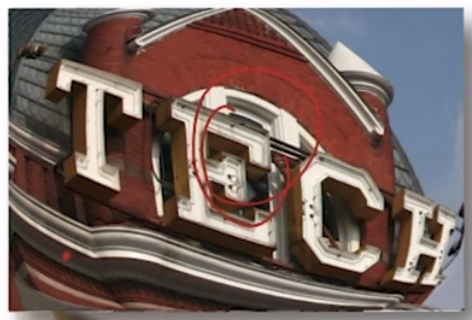
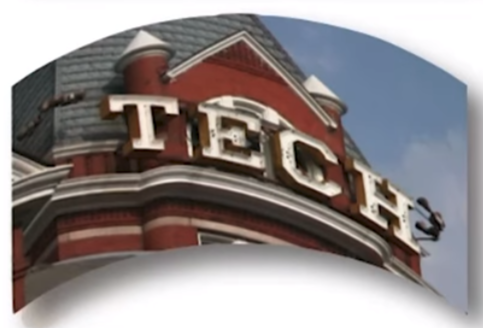
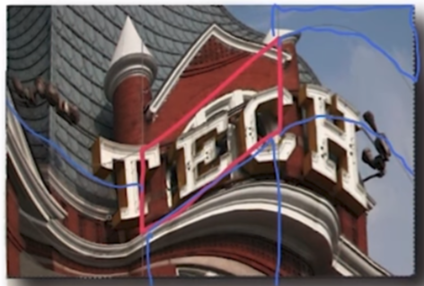

# 05-02 Image Morphing

## Image Warping
  * Image Transformation vs. Warping
    * Transformation: Lines remain lines
	* Warping: Points are mapped to points
  * Image Warping
    * Distorted through simulation of optical aberrations
	* 
	* Projected onto a curved or mirrored surface
	* 
	* Partitioned into polygons and each polygon distorted
	* 

## Forward and Inverse Warping

## Warping using a mesh

## Image Morphing
	
## Feature-based Image Morphing
