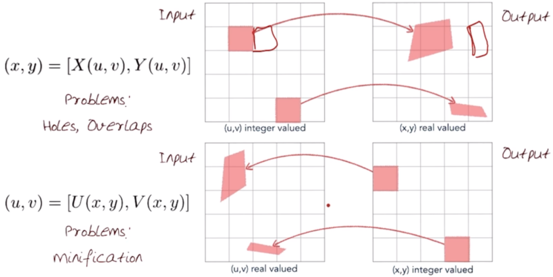
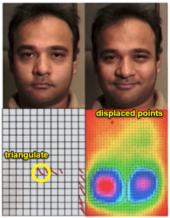
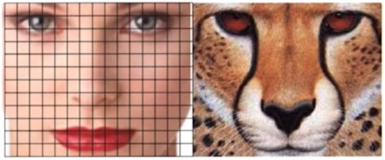
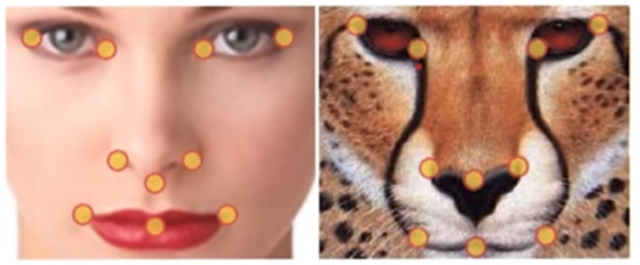
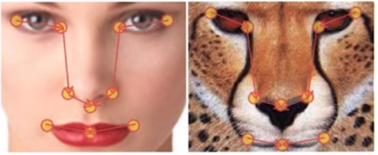
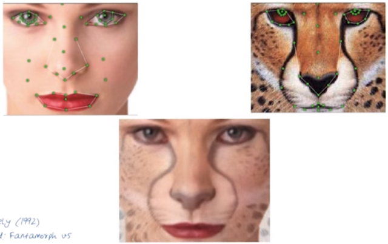

# 05-02 Image Morphing

## Image Warping
  * Image Transformation vs. Warping
    * Transformation: Lines remain lines
	* Warping: Points are mapped to points
  * Image Warping
    * Distorted through simulation of optical aberrations
	* 
	* Projected onto a curved or mirrored surface
	* 
	* Partitioned into polygons and each polygon distorted
	* 

## Forward and Inverse Warping
  * Forward - (x, y) = [X(u, v), Y(u, v)]
  * Inverse - (u, v) = [U(x, y), V(x, y)]
  * Problems
    * Forward: Holes, Overlaps
	* Whar if pixel lands between two pixels? ==> Distribute color among neighboring pixels
	* Inverse: Minification
	* Whar if pixel lands between two pixels? ==> Interpolate color value from neighbors
	* 
  * Forward vs. Inverse warping
    * Q: Which is better
	* A: Usaually inverse ==> eliminates holes, However it requires an invertible warp function ==> not always possible

## Warping using a mesh
  * Use a sparse set of corresponding points and interpolate with a displacement field
    * Triangulate the set of poins on source
	* Use the affine model for each triangle
	* Triangulate target with displaced points
	* Use inverse mapping
  * 

## Image Morphing
  * Quadrilateral mesh displaced with variational interpolation
  * 
  * Corresponding features/points
  * 
  * Corresponding orientated line segments(sepcifies translation, rotation, scaling)
  * 
	
## Feature-based Image Morphing
  * Doing the morphing using features(eyeball, lips, etc.)
  * 