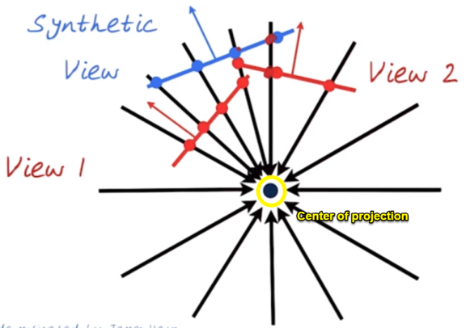
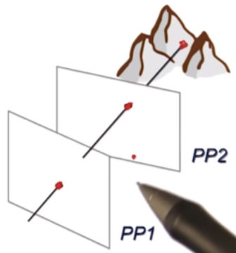
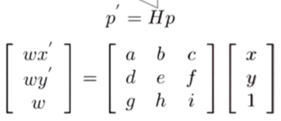
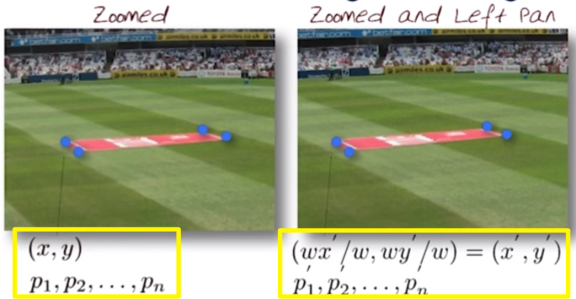
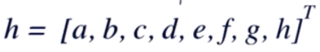
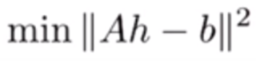

# 05-03 Panorama

## Generate a Panorama
  * 5 steps to make a panorama
    * (1) Capture images
	* (2) Detection and matching
	* (3) Warping -> aligining images
	* (4) Blending, fading, cutting
	* (5) Cropping(optional)
  * A bundle of rays contains all views
    * Possible to generate any synthetic camera view **<u>as long as it has the same center of projection</u>**
	* 

## Image Re-projection
  * To relate 2 images from the same camera center and map a pixel from PP1 to PP2
    * Rather than a 3D re-projection, **<u>think of it as a 2D image warp from one image to another</u>**
	* So don't need to know the geometry of the two planes with respect to the eyes
	* 

## Homography from a pair of images
  * Homography equations
    * 
  * To compute the homography H, given pairs of corresponding points in two images, we need to set up an equation where the parameters of H are unknowns
	* 
  * Solving for a homography
    * Set up a system of linear equations
	* **<i>Ah = b</i>**
	* 
	* Need at least 8 equations, the more the better
	* if we have more data than 8(the equations), **<u>solve using least squares</u>**
	* 

## Computing inliners and outliers
  * 
	
## Details of constructing panoramas
  * 